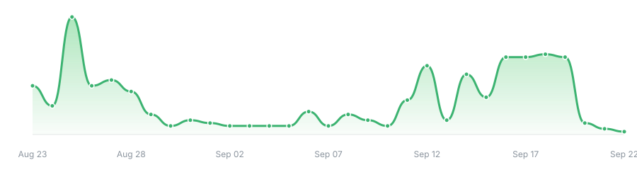

<!-- If you like what you see, simply replace my username with yours in your own profile -->
<!-- Any questions or suggestions, feel free to open an issue on the repository -->
<!-- Do not forget to leave a star or fork the repository if you like -->
<!-- Follow me on GitHub if you want to see more projects like this -->


<div align="left">
    
<picture>
  <source media="(prefers-color-scheme: dark)" srcset="https://raw.githubusercontent.com/fo9c/fo9c/main/image/title-dark.svg?v=1">
  <source media="(prefers-color-scheme: light)" srcset="https://raw.githubusercontent.com/fo9c/fo9c/main/image/title.svg?v=11">
  
</picture>
<h3>AI Agent Builder · Backend Engineer · Anime Fan</h3>
<blockquote><code>CODE MODE:</code> <!-- CODING_STATUS_START --><!-- CODING_STATUS_END --> &emsp; <!-- PRESENCE_STATUS_START --><!-- PRESENCE_STATUS_END --></blockquote>
<p>Building AI agents, LLM workflows, backend services, media tools, and automation systems. Exploring how models, APIs, and reliable engineering can come together to create practical products.<br>Outside of development, I am fascinated by distinctive aesthetics found in everyday life, unusual words and concepts, expressive illustration, and the imaginative world of anime.</p>
<p>
     
        
      
</p>

<div><small><strong>🌸 Visitors Count Received</strong></small></div>
<div></div>
<br clear="right">

</div>

<!-- ------------------------------------------------------------------------------------------------- -->

```text
                         ,,, /\_/\ ,,,                                              ⣿⢟⣽⣿⣿⣿⣿⣫⡾⣵⣿⣿⣿⠃⠄⠄⠘⢿⣿⣾⣿⣿⣿⢿⣿
                          \\=('o')=//                                               ⢫⣿⣿⣿⣿⡿⣳⣿⣱⣿⣿⣿⡋⠄⠄⠄⠄⠄⠛⠛⠋⠁⠄⠄⣿
////////////////////////////////////////////////////////////////////////////////    ⣿⣿⣿⣿⡿⣹⡿⣃⣿⣿⣿⢳⠁⠄⠄⠄⢀⣀⠄⠄⠄⠄⠄⢀⣿
&lt;&lt;&lt;&lt;&lt;&lt&lt;&lt;&lt;&lt;&l t;&lt;&lt;&lt;&lt;&lt;&lt;&lt;&lt;&lt;    ⡿⣿⣿⣿⢡⣫⣾⢸⢿⣿⡟⣿⣶⡶⢰⣿⣿⣿⢷⠄⠄⠄⠄⢼⣿
\\\\\\\\\\\\\\\\\\\\\\\\\\\\\\\\\\\\\\\\\\\\\\\\\\\\\\\\\\\\\\\\\\\\\\\\\\\\\\\\    ⣽⣿⣿⠃⣲⣿⣿⣸⣷⡻⡇⣿⣿⢇⣿⣿⣿⣏⣎⣸⣦⣠⡞⣾⢧
                           // (( \\                                                 ⣿⣿⡏⣼⣿⣿⡏⠙⣿⣿⣤⡿⣿⢸⣿⣿⢟⡞⣰⣿⣿⡟⣹⢯⣿
      __  ___          __ "'   )) "'__                 ____      ____               ⣿⣿⣸⣿⣿⣿⣿⣦⡈⠻⣿⣿⣮⣿⣿⣯⣏⣼⣿⠿⠏⣰⡅⢸⣿
     /  |/  /___ _____/ /__   ((   / /_  __  __       / __/___  / __ \_____         ⣿⣇⣿⣿⡿⠛⠛⠛⠛⠄⣘⣿⣿⣿⣿⣿⣿⣶⣿⠿⠛⢾⡇⢸⣿
    / /|_/ / __ `/ __  / _ \   `  / __ \/ / / /      / /_/ __ \/ /_/ / ___/         ⣿⢻⣿⣿⣷⣶⣾⣿⣿⣿⣿⣿⣿⣿⣿⣿⡋⠉⣠⣴⣾⣿⡇⣸⣿
   / /  / / /_/ / /_/ /  __/     / /_/ / /_/ /      / __/ /_/ /\__, / /__           ⣿⢸⢻⣿⣿⣿⣿⣿⣿⣿⣿⣿⣿⣿⣿⣿⣿⣄⠘⢿⣿⠏⠄⣿⣿
  /_/  /_/\__/_/\__,_/\___/     /_.___/\__, /      /_/  \____//____/\___/           ⣿⠸⣿⣿⣿⣿⣿⣿⠿⠿⢿⣿⣿⣿⣿⣿⣿⣿⣦⣼⠃⠄⢰⣿⣿
                                      /____/                                        ⣿⡄⠙⢿⣿⣿⡿⠁⠄⠄⠄⠄⠉⣿⣿⣿⣿⣿⣿⡏⠄⢀⣾⣿⢯
                                                                                    ⣿⡇⠄⠄⠙⢿⣀⠄⠄⠄⠄⠄⣰⣿⣿⣿⣿⣿⠟⠄⠄⣼⡿⢫⣠
```

<!-- ------------------------------------------------------------------------------------------------- -->

<p align="center">
  <a href="https://streak-stats.demolab.com/demo/">
    <picture>
      <source media="(prefers-color-scheme: dark)" srcset="https://streak-stats.demolab.com?user=fo9c&theme=dark&hide_border=true&background=transparent&ring=39D353&fire=58A6FF&currStreakNum=F0F6FC&sideNums=F0F6FC&currStreakLabel=39D353&sideLabels=8B949E&dates=8B949E">
      <source media="(prefers-color-scheme: light)" srcset="https://streak-stats.demolab.com?user=fo9c&theme=default&hide_border=true&background=transparent&ring=2DA44E&fire=0969DA&currStreakNum=24292F&sideNums=24292F&currStreakLabel=2DA44E&sideLabels=57606A&dates=57606A">
      
    </picture>
  </a>
</p>

[](https://github.com/fo9c)

<picture>
  <source media="(prefers-color-scheme: dark)" srcset="https://raw.githubusercontent.com/fo9c/fo9c/output/github-contribution-grid-snake-dark.svg">
  <source media="(prefers-color-scheme: light)" srcset="https://raw.githubusercontent.com/fo9c/fo9c/output/github-contribution-grid-snake.svg">
  
</picture>

----
<p align="center">
  <a href="https://github.com/fo9c"></a>
  <a href="https://twitter.com/us_3a"></a>
  <a href="https://gitee.com/fo9c_us"></a>
  <a href="https://www.youtube.com/@fo9c"></a>
  <a href="https://steamcommunity.com/profiles/76561199036378412/"></a>
  <a href="mailto:chengfo9c@163.com"></a>
</p>

<p align="center">
  <em>“嘘はとびきりの愛なんだよ”</em><br>
<!-- LAST_REFRESH_START -->
    Last refresh: 2026-09-25 04:01 CST
<!-- LAST_REFRESH_END -->
</p>

<p align="center">


</p>


<!-- ------------------------------------------------------------------------------------------------- -->


<!--


<div align="center">

[](https://git.io/typing-svg)
</div>

-->
